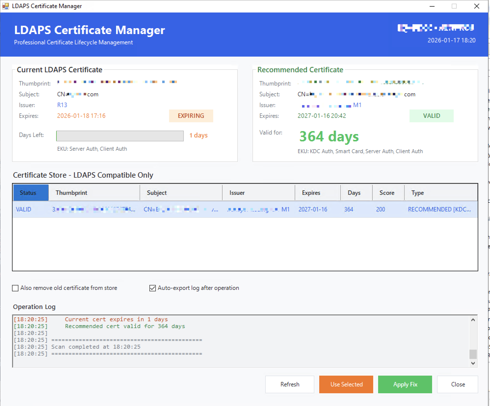
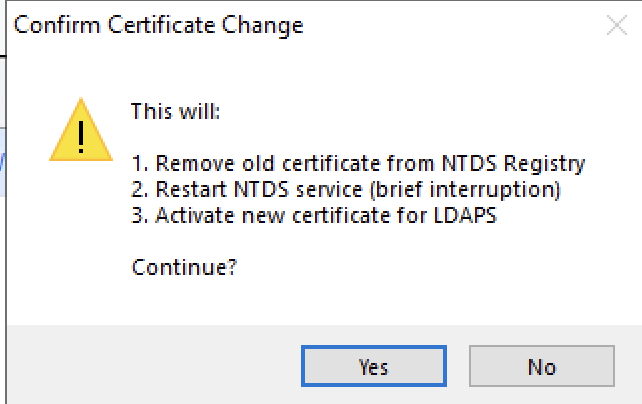
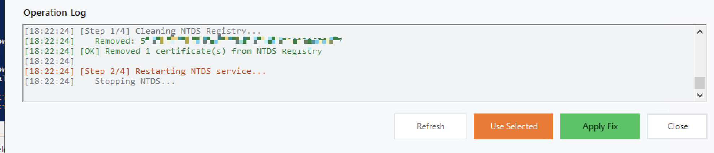
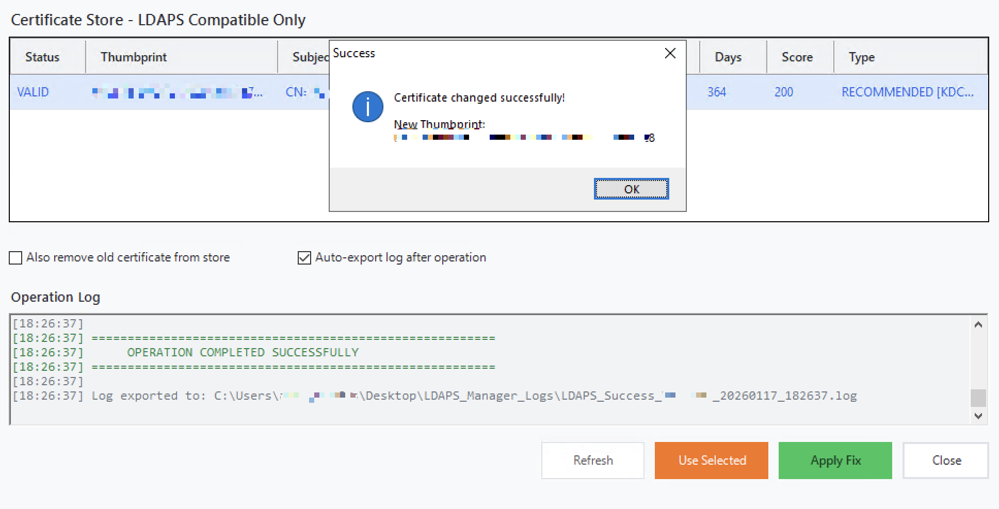
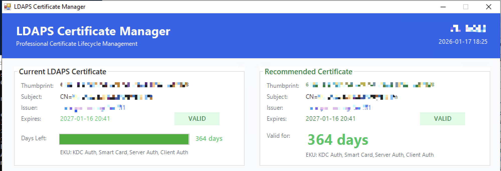

# LDAPS_Certificate_Manager
# LDAPS Certificate Manager GUI

Professional PowerShell GUI tool for managing LDAPS certificates on Windows Domain Controllers.

## Features

- ✅ **Automatic Detection** - Automatically detects current LDAPS certificate via Port 636
- ✅ **Smart Certificate Selection** - Provides intelligent scoring system for LDAPS-compatible certificates
- ✅ **Manual Override** - Enables manual selection from the certificate list when needed
- ✅ **Detailed Information** - Displays comprehensive certificate details including Issuer, Thumbprint, EKU, and Expire date
- ✅ **One-Click Fix** - Performs NTDS Registry cleanup and service restart with a single click
- ✅ **Cleanup Option** - Offers ability to remove old certificates from Certificate Store
- ✅ **Verification** - Validates that new certificate is active after operation
- ✅ **Logging** - Maintains automatic logging of all operations for audit purposes

## Screenshots

### Main Interface

*Main interface displaying current expiring certificate, recommended certificate details, certificate store list with scoring, manual selection option, cleanup options, and real-time operation log*

### Confirmation Dialog


*Confirmation dialog appears when clicking "Apply Fix" button, asking for user approval before proceeding with NTDS Registry cleanup and service restart*

### Operation Log

*Operation log displaying real-time progress of certificate change operations after confirmation, showing NTDS Registry cleanup steps and service restart process*

### Success Confirmation

*Success confirmation showing the new certificate is now active for LDAPS, with operation log displaying completion message and exported log file path*

### Final Verification

*Final verification screen displaying the new certificate is now active in the Current LDAPS Certificate panel, confirming successful certificate change*

## Usage

Run the script as Administrator on your Domain Controller:

```powershell
.\LDAPS_Certificate_Manager_GUI.ps1
```

## Requirements

- Windows Server (Domain Controller)
- Administrator privileges
- PowerShell 5.1 or later

## How It Works

The tool follows a four-step process:

1. **Analysis** - Connects to Port 636, scans Certificate Store, analyzes certificates
2. **Scoring & Decision** - Scores certificates for LDAPS compatibility, recommends best option
3. **NTDS Registry Cleanup** - Removes old certificate entries from NTDS Registry
4. **Restart & Verify** - Restarts NTDS service and verifies new certificate is active

## Important Notes

- ⚠️ **Administrator privileges required** - The script modifies registry and restarts services
- ⚠️ **Brief downtime expected** - NTDS restart causes 5-30 seconds of AD interruption
- ⚠️ **Test in non-production first** - Always validate in a test environment
- ✅ **Logs are saved automatically** - Check `LDAPS_Manager_Logs` folder for operation history

## License

MIT

## Author

Yusuf USTUNDAG
